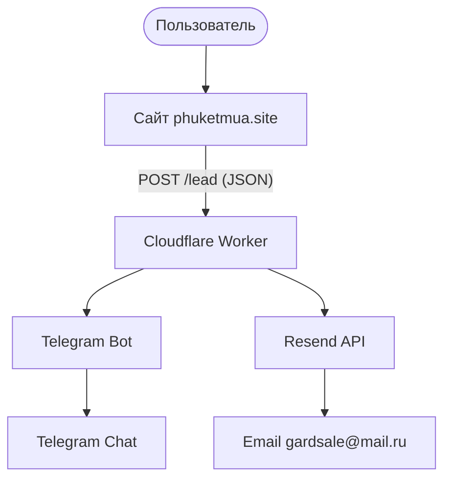

# 📐 Архитектура обработки лидов (phuketmua.site)

**Проект:** phuketmua.site  
**Версия:** 1.0  
**Дата:** 2026  

---

## 1️⃣ Общая схема

---

## 2️⃣ Компоненты системы

### 🌐 Фронтенд
- **Домен:** phuketmua.site
- **Метод:** POST
- **Формат:** JSON
- **Поля:**
  - `wechat` (обязательное)
  - `utm_source`
  - `utm_medium`
  - `utm_campaign`
  - `utm_content`
  - `utm_term`

### ⚙️ Backend — Cloudflare Worker
- **Платформа:** Cloudflare
- **Тип:** Edge Function
- **Функции:**
  - Принимает POST JSON.
  - Валидирует поле `wechat`.
  - Добавляет timestamp (Asia/Bangkok).
  - Формирует текст лида.
  - Отправляет данные в Telegram и Email через Resend.
  - Возвращает JSON `{ success: true }`.

### 🤖 Telegram уведомления
- **Платформа:** Telegram
- **API:** Bot API
- **Используется:** `BOT_TOKEN`, `CHAT_ID`.
- **Назначение:** Мгновенное уведомление о новом лиде.

### 📧 Email отправка
- **Платформа:** Resend
- **Используется:** `RESEND_API_KEY`, домен `phuketmua.site` (verified).
- **Назначение:** Резервная копия, архивирование.

---

## 3️⃣ DNS конфигурация
У домена должны быть настроены:
- **SPF:** `v=spf1 include:_spf.google.com include:mailchannels.net include:resend.com ~all`
- **DKIM (от Resend):** 3 CNAME записи.

---

## 4️⃣ Environment Variables (Worker)
| Переменная | Назначение |
| :--- | :--- |
| `BOT_TOKEN` | Токен Telegram бота |
| `CHAT_ID` | ID чата/пользователя в Telegram |
| `RESEND_API_KEY` | API ключ сервиса Resend |

---

## 5️⃣ Поток обработки запроса
1. Клиент отправляет POST JSON.
2. Worker проверяет метод, Content-Type и наличие `wechat`.
3. Формируется текст лида.
4. Параллельно выполняются `sendTelegram()` и `sendEmail()`.
5. Если оба успешны → `success: true`.
6. Ошибки логируются в Worker Logs.

---

## 6️⃣ Защита
- **Текущая:** CORS ограничен доменом, проверка метода/JSON, обязательное поле `wechat`.
- **Рекомендуемые (v2):** Honeypot поле, Rate limit по IP, Cloudflare Turnstile.

---

## 7️⃣ Надёжность
Система устойчива, так как работает на "edge" (максимально близко к пользователю), использует Telegram как мгновенный канал и Email как резервный. Нет зависимости от центрального сервера.

---

## 8️⃣ Точки отказа
- **Telegram:** Бот заблокирован или упал API.
- **Resend:** Домен не верифицирован или превышен лимит.
- **DNS:** Удаление записей SPF/DKIM.
- **Worker:** Отсутствие или неверные переменные окружения.

---

## 9️⃣ Масштабируемость
Легко добавить:
- Запись в Google Sheets / Supabase.
- Webhook в CRM.
- Meta Conversion API.
- Автоответ клиенту.

---

## 🔟 Итоговая архитектурная модель
Это **serverless lead-capture система** без собственного сервера, базы данных и классического хостинга. Полностью edge-based.

**Архитектурный стиль:** Event-driven edge processing.
